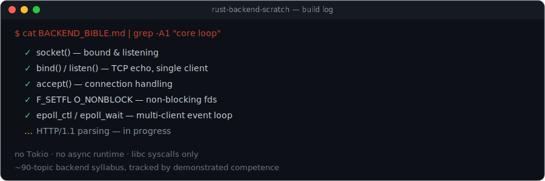

  

 

### 🟢 Live

**E-Cell KIET App** — lead maintainer, live on Play Store

**NEXUS** — adaptive assessment platform, Rust/Axum, deployed on GCP, director-endorsed pilot. Hardened against an authorization vulnerability found in audit.

### 🟡 In progress

  

<a href="https://github.com/RudreshRajvansh/rust-backend-scratch">→ repo</a>

**QSafe** — post-quantum Android password manager. ML-KEM-768 (FIPS 203), ML-DSA-65 (FIPS 204), FIDO2, SQLCipher. Pre-release, pending third-party audit.

**RudraCrypt** — Kotlin post-quantum cryptography library, self-describing versioned tokens. Pre-release.

**FocusJar** — Android focus timer. In development.

---

  
  

---

### 🌐 Elsewhere

  
  
  

### 🏆 Background

AWS Triple Certified (Solutions Architect, Cloud Practitioner, AI Practitioner) · 14th place, CTF7 (16 flags, including an extreme-difficulty cipher challenge)
