<h1 align="center">Hey, I'm Rudresh 👋</h1>

  

 

I build Android apps — Kotlin, Jetpack Compose, shipped to the Play Store. 
I write backend systems in Rust, straight against Linux syscalls, no framework in between. 
I find and close real security gaps in the software I maintain.

 

  

 

## Elsewhere

[LeetCode](https://leetcode.com/u/RudreshRajvansh/) · [Codeforces](https://codeforces.com/profile/RudreshRajvansh) · [HackerRank](https://www.hackerrank.com/profile/rudreshrajvansh0)

AWS Triple Certified (Solutions Architect, Cloud Practitioner, AI Practitioner) · 14th place, CTF7 (16 flags, including an extreme-difficulty cipher challenge)

 

  <picture>
    <source media="(prefers-color-scheme: dark)"  srcset="https://raw.githubusercontent.com/RudreshRajvansh/RudreshRajvansh/output-3d-contrib/night.svg" />
    <source media="(prefers-color-scheme: light)" srcset="https://raw.githubusercontent.com/RudreshRajvansh/RudreshRajvansh/output-3d-contrib/day.svg" />
    
  </picture>

